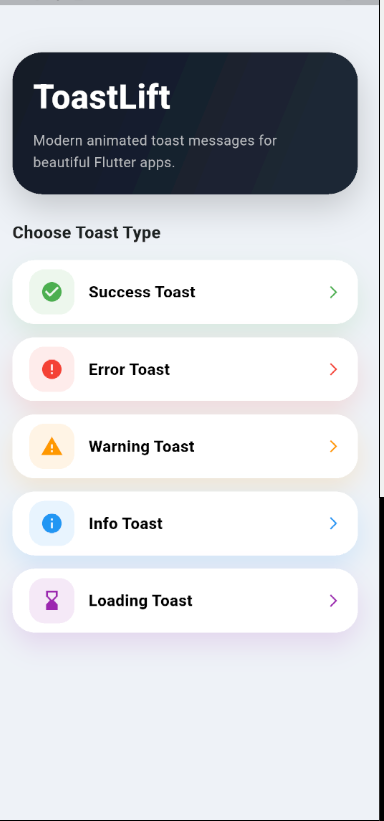
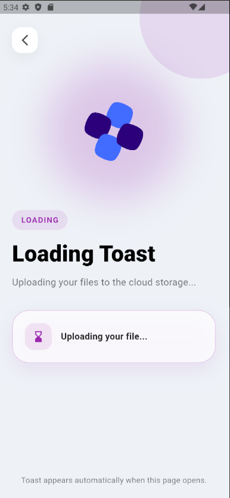

# ToastLift 🚀

A beautiful, animated, and modern Flutter toast package with swipe dismiss, premium UI, multiple toast types, smooth animations, and Lottie-powered showcase screens.
ToastLift helps developers display elegant floating toast notifications with minimal code.

---

## ✨ Features

- 🎨 Premium modern toast UI
- ⚡ Smooth fade & slide animations
- 👆 Swipe to dismiss
- 🌈 Multiple toast types
- 📍 Top / Bottom / Center positions
- 🧩 Custom title & message support
- 💎 Colored borders & soft shadows
- 🪄 Lightweight and easy to use
- 📱 Responsive design
- 🎬 Lottie animated showcase demo

---

## 📸 Screenshots

<p>
  
  &nbsp;&nbsp;&nbsp;
  
</p>

---

# 📦 Installation

Add this to your `pubspec.yaml`:

```yaml
dependencies:
  toast_lift: ^1.0.1
```

Then run:

```bash
flutter pub get
```

---

# 🚀 Import

```dart
import 'package:toast_lift/toast_lift.dart';
```

---

# ✅ Basic Usage

```dart
ToastLift.show(
  context,
  title: "Success",
  message: "Profile updated successfully!",
  type: ToastLiftType.success,
);
```

---

# 🎨 Toast Types

## Success Toast

```dart
ToastLift.show(
  context,
  title: "Success",
  message: "Your profile was updated!",
  type: ToastLiftType.success,
);
```

---

## Error Toast

```dart
ToastLift.show(
  context,
  title: "Error",
  message: "Something went wrong!",
  type: ToastLiftType.error,
);
```

---

## Warning Toast

```dart
ToastLift.show(
  context,
  title: "Warning",
  message: "Please check your input.",
  type: ToastLiftType.warning,
);
```

---

## Info Toast

```dart
ToastLift.show(
  context,
  title: "Info",
  message: "New update available.",
  type: ToastLiftType.info,
);
```

---

## Loading Toast

```dart
ToastLift.show(
  context,
  title: "Loading",
  message: "Uploading your file...",
  type: ToastLiftType.loading,
);
```

---

# 📍 Toast Positions

## Bottom Position

```dart
position: ToastLiftPosition.bottom,
```

## Top Position

```dart
position: ToastLiftPosition.top,
```

## Center Position

```dart
position: ToastLiftPosition.center,
```

---

# ✨ Full Example

```dart
ToastLift.show(
  context,
  title: "Success",
  message: "Profile saved successfully!",
  type: ToastLiftType.success,
  position: ToastLiftPosition.center,
);
```

---

# 👆 Swipe To Dismiss

Users can dismiss the toast by swiping left or right.

---

# 🛠 Built With

- Flutter
- Dart
- Lottie Animations

---

# 📄 License

MIT License

---

# ❤️ Support

If you like this package, give it a ⭐ on GitHub and support the project.

# MarkDown

[](https://pub.dev/packages/toast_lift)

# 🌐 GitHub

View source code, report issues, or contribute here:

https://github.com/Sakshi-2508/toast_lift
